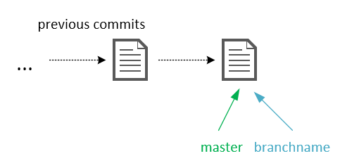

# Git

Git was created by Linus Torvalds for development of the Linux kernel aimed towards data integrity and speed. It quickly became popular not in the least because of [Github](https://github.com), a web-based Git hosting service.

## Git installation

Get the latest Git release from [git-scm.com. ](https://git-scm.com/)Although many Graphical User Interface \(GUI\) clients for Git exist, this tutorial is going to focus on the command line tool. Mainly because the command line interface is a valuable tool for software development and system administration.

When going through the installer, adjust the PATH environment accordingly. If you forget to select to use Git from the Windows Command Prompt it is possible to change the PATH environment variable to include the Git\bin directory.


When installed correctly, open a command prompt \(hit windows key, start typing cmd and hit enter\).  All command line input is indicated in the grey rectangle.

```
> git
```

When you type in the command git, the following output is given.


After installation, Git must be configured with a name and e-mail address. This is important because every Git commit is accompanied with this information.

```
> git config --global user.name "Firstname Lastname"
> git config --global user.email "Firstname.Lastname@example.com"
```

## Start

There are two possiblities to start working with a Git repository. In an empty directory either create a new repository

```
> git init
```

or clone an existing repository

```
> git clone https://github.com/pcordemans/algorithms
```

In the directory a hidden .git folder will appear. This .git folder effectively contains the entire repository.  
**Hint:** to start a new repository on Github, make a new project on Github, then clone it locally. The other way around is also possible, but it requires a few more steps.

## Committing changes

Two steps are needed to commit a change to a local repository. First, all changes to be committed must be added to the _staging area_. To add all changes

```
> git add --all
```

Then the staging area can be committed to the repository.

```
> git commit -m"Add your descriptive message here"
```

The -m flag defines the commit message. Committing without a message is strongly discouraged. Should you forget the message flag, a text processor will be started \(default is vim\) to write a commit message.

Finally, in order to push the commit to the server.

```
> git push origin master
```

_Origin_ is the default name of the remote server. _Master_ is the name of the current branch to be pushed. In order to view a list of the remote servers.

```
> git remote -v
```


## Some useful commands

View the current status

```
> git status
```

View the log

```
> git log
```

Notice that the commit number is a random hash. This hash can be used to refer to a specific commit. Most tools support completion of the hash if the first characters are entered.

View all changes between the working directory and latest commit.

```
> git diff
```
## Ignoring files

Typically a repository only contains source code, documentation and configuration files. Everything that can be generated by a compiler or some other tool should be left out of the repository. In order to prevent files from being committed to a Git repository, add a file named _.gitignore_. Every pattern added to this file indicates files or directories no longer considered to add or commit to the repository. For example

 ```
 someFile.txt
 .*
 !.gitignore
 *.class
 /bin/ 
 ```
The first rule excludes files named _someFile.txt_. Second rule excludes all files starting with a point. The asterisk is a wildcard in the pattern which may indicate one or more characters. The third rule is an exception to the second rule allowing the .gitignore file to be included in the repository, this is indicated with an exclamation mark. Typically .gitignore files are added to the repository, so they are cloned with the rest of the repository. Fourth rule ignores all files with the _.class_ file type. Final rule excludes the directory _bin_.

## Branching

A branch is a pointer to a specific commit in the repository. Branching creates a new pointer.

```
> git branch branchname
```

The default branch is called _master_ and will typically point at the latest stable release of the project. Note that committing actually moves the current branch to the new commit.  
Before branching beware that all uncommitted changes in the working directory will be discarded to switch to another branch. In order to switch to another branch use a checkout. It is also possible to use the hash of a previous commit in order to jump to that commit with a checkout.

```
> git checkout branchname
```

An example, in the starting situation there are some previous commits and the latest commit is pointed at with the master branch.


Now the new branch must be created first and then switched to. The -b flag creates the new branch first and checkout immediately jumps to the new branch.

```
> git checkout -b branchname
```

Notice that creating a new branch this way makes the new branch point at the same commit as the master branch.



Committing to the current active branch will advance the pointer further.

```
> git add --all
> git commit -m"Descriptive message about the commit"
```


To merge the new code in the master branch perform a merge.

```
> git checkout master
> git merge branchname
```

Always checkout the branch where you want to merge to. Then execute the merge command. These two commands effectively moves the master branch pointer forward.


If both branches have one or more new commits starting from the common commit, a new commit is added where both are merged to.

Finally, when a branch is no longer needed delete the branch

```
> git branch -d branchname
```

This was a very basic introduction about the usage of Git. [Pro Git by Scott Chacon and Ben Straub](https://git-scm.com/book/en/v2) is a great free reference for more information.