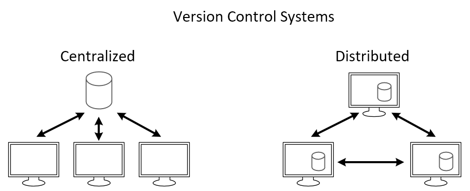

# Version Control Systems

A version control system is an indispensable tool for modern software development. Version control keeps track of changes of text-based documents such as source code, configuration files and text documents. For instance this website is written in a tool which is built on top of a version control system named Git. The [history](https://github.com/VIVES-Elektronica-ICT-Brugge/git-python-pi-web) of the document can be viewed at Github. 

Version control systems also facilitate collaboration between multiple people on a project. However, even a single person working on a project might benefit from using a version control system. Think of working without a version control system as using an old style typewriter. Typing on a typewriter one could not afford to make mistakes, as correcting a mistake was very difficult. In contrast, in a modern text processor it is very easy to correct a mistake with undo/redo. A version control system is the proverbial undo/redo button to allow changing a document without fear of making a mistake.

Central to version control systems is a repository. The repository is a collection of files which are tracked and it allows to view the history of each of these files, revert to another version or merge changes on a single file. Each version is called a commit, as changes are committed to a version.

There are many version control systems and these tools can be divided in two classes. On the one hand are centralized systems, which rely on a server to keep track of the repository. Subversion and Team Foundation Server are examples. These systems are typically older, are typically more difficult to setup and do not scale as well with larger teams. On the other hand are distributed version control systems, e.g. Git and Mercurial. In these systems each contributor keeps track of the full repository locally and (optionally) a server only facilitates sharing the repository. Intuitively this might seem to make collaboration more difficult, in practice distributed workflows allow for a conflict-free collaboration. For instance, most large modern software repositories are stored in a distributed version control system, e.g. the [Windows kernel in Git](https://arstechnica.com/information-technology/2017/02/microsoft-hosts-the-windows-source-in-a-monstrous-300gb-git-repository/) or [Facebook in Mercurial](https://code.facebook.com/posts/218678814984400/scaling-mercurial-at-facebook/).

