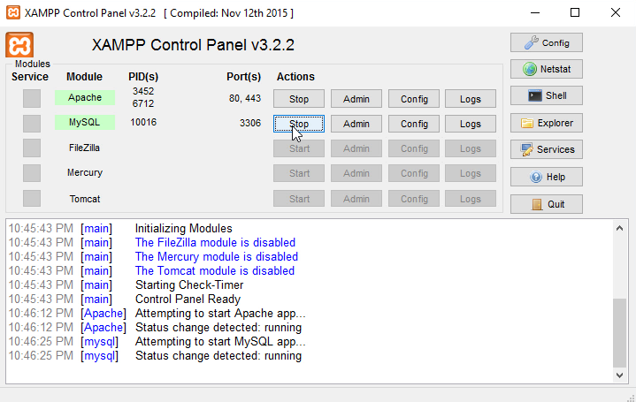

# LAMP Server

The Raspberry Pi is just a Linux machine. It is possible to run any software that could be executed on other systems like laptops, desktops or even server. This enables the Raspberry Pi to function as a Web server to host modern web applications or websites. A webserver consists out of many components and technologies that work together to function. A common setup is called the LAMP stack. LAMP consists out of open-source software and is an acronym for:

* **L**inux: The operating system that is used
* **A**pache: a webserver that speaks the HTTP protocol
* **M**ySQL: A database that will manage data
* **P**HP: A programming language that enables to build dynamic webpages on the server


Linux is already available on the Raspberry Pi in the form of the Raspbian distribution. Therefor it is not necessary to explicitly install this on the Raspberry Pi.

## Installing LAMP components

Before we can start and make use of the LAMP stack, we need to install all the components separately. The best way to do this is to  use the terminal with a set of commands.

> #### tasksel
>
> Some Linux distributions come with a tool called `tasksel`. Tasksel enables you to select the tasks that you would like to execute on the system. This tool has an option to install the full LAMP stack with only a single command. The Rasperry Pi with Raspbion however does not support this tool at the moment.

### Updating Raspbian

First we need to update Raspbian operating system to the latest version. This can be done with the following commands:

```shell
sudo apt update
sudo apt upgrade -y
```

Once ready, you can continue with the installation of all the LAMP components.

## XAMPP

Apache, MySQL and PHP are not strictly available on Linux systems. The software can run on Windows, OS X just as wel. All packages could be installed separately, but there are initiatives that make an all-in-one installation package. [XAMPP](https://www.apachefriends.org/) from ApacheFriends is one of them. XAMPP also adds Perl to the package. Perl is another programming language that could be used in a web hosting context, although it is not that popular any more.


### Local development

It is a good practice to develop web applications locally on your own computer first. There are many reasons to develop on a different machine than the actual server.

* You don't have to worry to break existing services that are already available on the server
* Users won't see any intermediate and broken applications while you are developing
* You can try and install whatever dependencies your project might need
* You can use whatever development tools you need.
* It's way faster to test and develop (no file transfers, or using a terminal application)
* You don't have to worry to lose any important data due to tests or bugs
* You can find and fix bugs before they are available to the public
* You don't need a high speed, or even any connection to the server

Most developers install XAMPP or any other alternative to develop applications locally. The best practice is to use a version control system, like git and GitHub to manage and deploy code to your server. This enables a lot of automation, like running tests before deploying and installing small incremental updates.

