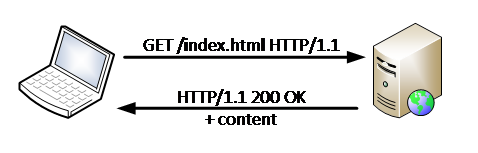
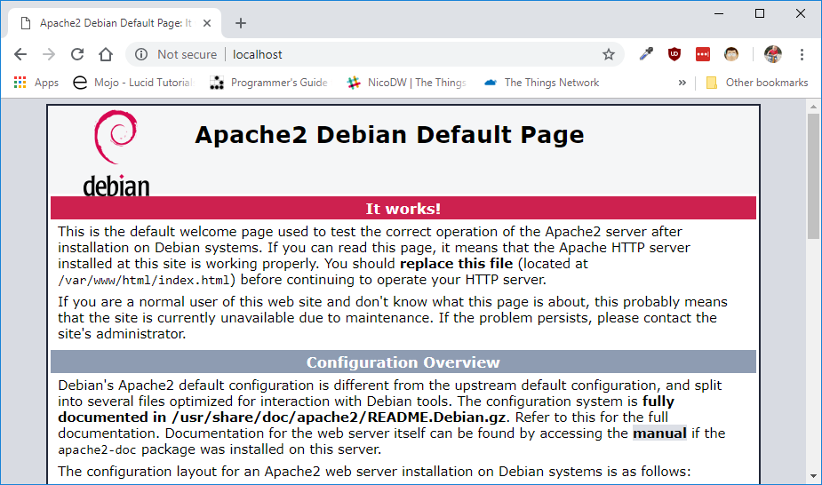

# Apache HTTP server

The internet is a large network of computers. Not all computers have the same task. Some are always available and serve information. Others are only temporally available and will access information from others. This model is called the client/server model.

>The client/server model is a computing model that acts as a distributed application which partitions tasks or workloads between the providers of a resource or service, called servers, and service requesters, called clients. Source: wikipedia

The client/server model is an **asymmetric** model. This means that not all participants (computers) in this model have the same task or responsibility. This is in contrast to the Peer-to-Peer or P2P model, where all participants have the same responsibility or task.

In the client/server model we have the servers that are always available. They only wait for requests and will never initiate communication. The clients are only temporary active and initiates the communication.

Apache is a server application that speaks and understands the HTTP protocol.

## HTTP protocol

The HTTP protocol is created for Client-Server applications. A protocol is a system of rules that allow two or more entities of a communications system to transmit information. The HTTP protocol is standardized by the IETF - Internet Engineering Task Force - and defines how to request information and respond to that request. HTTP stands for HyperText Transfer Protocol.



The HTTP protocol is a plain text protocol and is thus readable for humans. You can use the developer tools in your browser to inspect the communication between your computer and the server. HTTP makes use of port 80 by default, although it is possible to run HTTP servers on any port number.

HTTP is also a stateless protocol. This means that no information is shared between any request. There are means to retain state between request to make a stateful connection. This makes use of cookies, sessions or tokens.

### Request

The request message consists of the following:

* **Request line**: which include the file you would like to request
* **Header fields**: such as Content-Type: application/json,… Many headers exit to provide extra meta data about the request. Only the `host` header is mandatory, others are optional
* **Empty line**: used to mark the end of the header, and the start of the content
* **message body**: This is optional and could contain information that needs to be send to the server, for example form data

```text
GET /index.html HTTP/1.1
Host: www.vives.be
```

### Response

The response message consists of the following:

* **Status line**: which include the status code and reason message
* **Header fields**: such as Content-Type: text/html, …. Many headers exit to provide extra meta data about the response
* **Empty line**: used to mark the end of the header, and the start of the content
* **message body**: This is optional and will contain the requested content

```text
HTTP/1.1 200 OK
Content-Type: text/html; charset=utf-8

<html>….</html>
```

## Hosting files

Apache can be configured to host multiple websites. The `Host` header in the HTTP request will make a distinction between the different websites. This can all be configured with `.conf` files in the `/etc/apache2/sites-available/` directory.

By default, Apache will host all files that are placed inside the `/var/www/html` directory. If you place a file in this directory, it will become available using the HTTP protocol. For example, if you add a picture file called `cat.jpg` in the `/var/www/html` directory. You can surf to [http://localhost/cat.jpg](http://localhost/cat.jpg) to fetch it.

If you use XAMPP on Windows, the default hosting directory is placed under `C:/xampp/htdocs`.

## Installation

Apache can be simply installed using the apt package manager. Just run the following command in the terminal:

```shell
sudo apt install apache2 -y
```

This should do it. Easy isn't it?

## Testing it out

If everything went well, the Raspberry Pi will function as an HTTP server using Apache. The simplest way to to test this is on the Raspberry Pi itself. Just open a browser and surf to [http://localhost](http://localhost). You should then get the _Apache Debian Default Page_.



It is also possible to access the webpage from another machine. The only requirement is that the client is in the same network. To do this, you just need the IP address of the Raspberry Pi. To get the IP you could execute the `ifconfig` command in the terminal. The IP address can then be found in the `eth0` interface configuration, next to `inet`. In the example below, the IP address is `172.16.1.228`.

```text
pi@raspberrypi:~ $ ifconfig
eth0: flags=4163<UP,BROADCAST,RUNNING,MULTICAST>  mtu 1500
        inet 172.16.1.228  netmask 255.255.0.0  broadcast 172.16.255.255
        inet6 fe80::6f6:6b2a:3fc2:1c1  prefixlen 64  scopeid 0x20<link>
        ...

lo: flags=73<UP,LOOPBACK,RUNNING>  mtu 65536
        ....

wlan0: flags=4099<UP,BROADCAST,MULTICAST>  mtu 1500
        ...
```

You can now surf from any machine in the network to [http://172.16.1.228](http://172.16.1.228).

