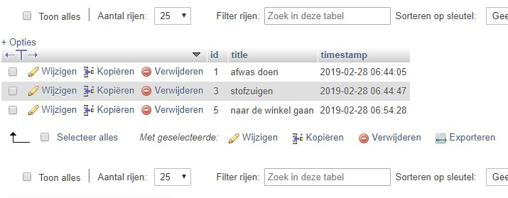
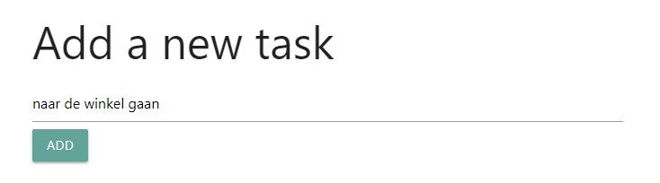
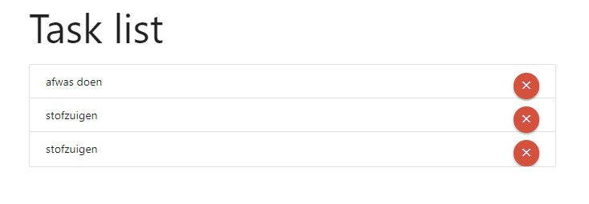
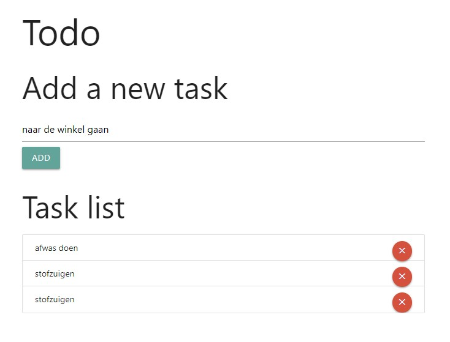

# Todo app

As an example that makes use of Linux, Apache, MySQL and PHP, lets create a small but simple 'todo' application. The todo application will enable users to manage tasks. A form will provide a way to add tasks to the database. A list of current tasks will be shown to the user, and when a task is done, a button will enable the user to delete it from the database.

## Database

First lets create a `todo ` database that can hold our `tasks` table. A task has a couple of properties such as:

* `id`: an identifier to reference the task in code
* `title`: the title or description of a task
* `timestamp`: the date and time when the task was created

The `id` is set as `PRIMARY KEY`. This prevents duplicate values and optimizes the database when searching based on the id.
The `title` is made mandatory by setting the `NOT NULL` property.
The `timestamp` gets a default value of `CURRENT TIMESTAMP`. If we add a new row to the database, we do not need to specify any date or time, the database will pick the current time and date automatically.

```sql
CREATE DATABASE todo;
USE todo;
CREATE TABLE tasks (
  id INT AUTO_INCREMENT PRIMARY KEY,
  title VARCHAR(32) NOT NULL,
  timestamp DATETIME DEFAULT CURRENT_TIMESTAMP
);
```

If we run the queries above, the database is ready to manage our data.

In phpMyAdmin we can then manage the database and maybe already add some data.



## Todo class

Now that the database is ready, we can develop some PHP code that interacts with the database. The best way to do this is by creating a `Todo` class. We can then later on use instances of that class wherever we want to get access to the task that are stored in the database.

```php
<?php

class Todo
{
  public function __construct()
  {
    $this->pdo = new PDO("mysql:host=localhost;dbname=todo", "root", "");
  }

  public function getTasks()
  {
    $stm = $this->pdo->query("SELECT * FROM tasks");
    return $stm->fetchAll(PDO::FETCH_OBJ);
  }

  public function addTask($title)
  {
    $query = "INSERT INTO tasks (title) VALUES (?);";
    $this->pdo->prepare($query)->execute([$title]);
  }

  public function removeTask($id)
  {
    $query = "DELETE FROM tasks WHERE id = ?;";
    $this->pdo->prepare($query)->execute([$id]);
  }
}
```

The constructor is executed automatically whenever you create a new instance of that class. The constructor will create a connection to the database using a `PDO` object. `PDO` is a built in class, provided by PHP to communicate with a database. PDO supports multiple types of database, which makes switching to another database super easy.

The `PDO` constructor needs some information to setup a connection. In this case we tell the PDO that we want to connect to a MySQL database on `localhost`, and that our database is called `todo`. Next we need to provide the user and its password.

The `Todo` class will provide some methods that will do the hard work:

* `getTasks()`: This method will return all tasks that are stored in the database
* `addTask($title)`: Given a _title_, this method will store it as a new task in the database
* `removeTask($id)`: Given an _id_, this method will remove the task from the database

You can see that the methods use SQL queries that will be executed on the MySQL database, and catches the results that the database return in PHP variables and methods.

## PHP document

Now that we have something in PHP that can access and manipulate tasks in the database, we can make use of this functionality to build a functional application.

### Application logic

The dynamic part is provided by PHP code inside a document that also defines HTML. It is a good practice to bundle as much as PHP code together at the top of the document. In this PHP code block we first `require` the file containing the `Todo` class. Now we can use the class, and create a new instance that we safe in the `$todo` variable.

Forms will be used to send information to the script. We will be using an HTTP POST request for this. If we check the `$_POST` array for values `newtask` or `delete`, we can extract that information and pass it to the `$todo` instance which will do all the hard work for us.

At the end of the script, we just ask the `$todo` instance to give us all the tasks that are defined in the database. We cannot show them yet, so we keep this `$tasks` variable for later use.

```php
<?php

require_once('todo.php');
$todo = new Todo();

if(isset($_POST['newtask'])) {
  $todo->addTask($_POST['newtask']);
}

if(isset($_POST['delete'])) {
  $todo->removeTask($_POST['delete']);
}

$tasks = $todo->getTasks();
```

### HTML boilerplate

The first part of the HTML code is some boilerplate code. It will fetch some CSS, JavaScript and Icons from the internet. These files are part of the [Materialize](https://materializecss.com) framework. All this does is give our website a nicer look and feel. To make use of this the HTML document will mentions `class="something"`, and some extra elements will be introduced.

```html
<!DOCTYPE html>
<html lang="en">
<head>
  <meta charset="UTF-8">
  <meta name="viewport" content="width=device-width, initial-scale=1.0">
  <meta http-equiv="X-UA-Compatible" content="ie=edge">
  <link rel="stylesheet" href="https://cdnjs.cloudflare.com/ajax/libs/materialize/1.0.0/css/materialize.min.css">
  <script src="https://cdnjs.cloudflare.com/ajax/libs/materialize/1.0.0/js/materialize.min.js"></script>
  <link href="https://fonts.googleapis.com/icon?family=Material+Icons" rel="stylesheet">
  <title>Todo app</title>
</head>
```

### Add new task form

The next part will show a small form with a single input text field. Here we can type in new tasks, and when we press the 'add' button, the form will send the information to the same file `index.php` with a new `HTTP POST` request. The script can then analyse and process the new data.

```html
<h2>Add a new task</h2>
<form action="index.php" method="post">
  <input type="text" name="newtask">
  <button type="submit" class="btn">Add</button>
</form>
```

This will show a form like the image below.



### Task list

The second form is a bit more complicated. This form contains a list of all tasks. The tasks where previously fetched using the `Todo` class instance. Now we can iterate over them using a `foreach()` loop. For every task that we get, a new `<li>` list item will be made. Here we will show the title `echo $task->title`.

The form will also show a button for every task that will handle the removing of the task once it is completed. Because many buttons will be inside the form, we need to make sure only to delete the task where the button corresponds with. Therefore we add a value to the button, that will be send to the page using a HTTP POST, containing the id ` echo $task->id` of the task.

```php
<form action="index.php" method="post">
  <ul class="collection">
    <?php foreach ($tasks as $task) { ?>
        <li class="collection-item">
          <?php echo $task->title; ?>
          <button type="submit"
            class="btn-floating btn-small waves-effect 
              waves-light red secondary-content"
            name="delete" value="<?php echo $task->id ?>">
            <i class="material-icons">close</i>
          </button>
        </li>
    <?php } ?>
  </ul>
</form>
```

This will show a task list like the image below.



## Result



This should be all. When combining the parts, it will result in the code below. This is all we need to make a simple todo application using MySQL, PHP and Apache.

```php
<?php

require_once('todo.php');
$todo = new Todo();

if(isset($_POST['newtask'])) {
  $todo->addTask($_POST['newtask']);
}

if(isset($_POST['delete'])) {
  $todo->removeTask($_POST['delete']);
}

$tasks = $todo->getTasks();

?>

<!DOCTYPE html>
<html lang="en">
<head>
  <meta charset="UTF-8">
  <meta name="viewport" content="width=device-width, initial-scale=1.0">
  <meta http-equiv="X-UA-Compatible" content="ie=edge">
  <link rel="stylesheet" href="https://cdnjs.cloudflare.com/ajax/libs/materialize/1.0.0/css/materialize.min.css">
  <script src="https://cdnjs.cloudflare.com/ajax/libs/materialize/1.0.0/js/materialize.min.js"></script>
  <link href="https://fonts.googleapis.com/icon?family=Material+Icons" rel="stylesheet">
  <title>Todo app</title>
</head>
<body>
  <div class="container">
    <h1>Todo</h1>

    <h2>Add a new task</h2>
    <form action="index.php" method="post">
      <input type="text" name="newtask">
      <button type="submit" class="btn">Add</button>
    </form>

    <h2>Task list</h2>
    <form action="index.php" method="post">
      <ul class="collection">
        <?php foreach ($tasks as $task) { ?>
            <li class="collection-item">
              <?php echo $task->title ?>
              <button type="submit"
                class="btn-floating btn-small waves-effect 
                  waves-light red secondary-content"
                name="delete" value="<?php echo $task->id ?>">
                <i class="material-icons">close</i>
              </button>
            </li>
        <?php } ?>
      </ul>
    </form>
  </div>
</body>
</html>
```