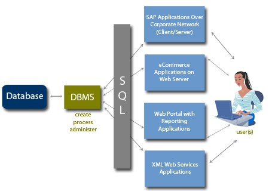
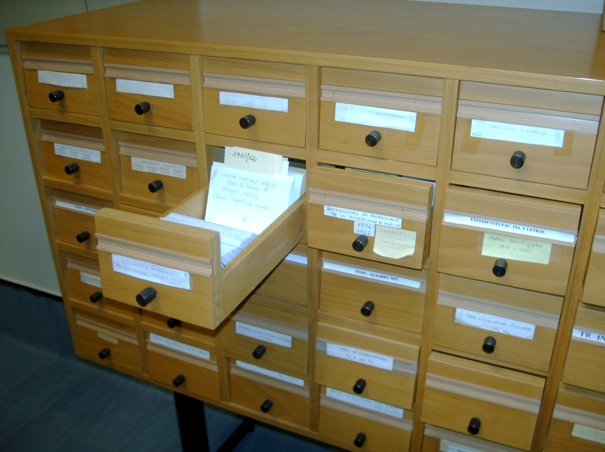

# MySQL Database

MySQL has become one of the most popular database management systems in the world. It can be used for small development projects to large and prestigious sites on the web. MySQL has proven itself to be solid, reliable, fast and trusted to all sorts of data storage needs.

MySQL and MariaDB are open source and free to use. This makes it one of the most popular databases. It is also the best supported and best documented database for web based projects. For example with PHP.


> #### MySQL vs MariaDB
> 
> MySQL is maintained by Oracle. MySQL is free to use but not entirely open source. Some parts are closed source. This was not the vision of the original developers. Therefor they created a fork that replaces the closed source parts with open source alternatives. This fork is called MariaDB, and guarantees to stay open source.
>
> MariaDB and MySQL are therefor compatible. All MySQL command are compatible with MariaDB and vica versa.

## What is a database? 

The word database is used in many ways. For our purpose we will use the following definition:

> A database is a collection of data stored in some organized fashion

You can think of a database as some kind of cabinet. It is simply a physical location to store data, regardless of what data is or how it is stored.

## DataBase Management System - DBMS

The term `database` does not refer to the database software that is used. This might create much confusion if not used correctly. The database software is called the Database Management System or DBMS.

The database is the container that is created and can be manipulated using the DBMS. MySQL in this case is a DBMS system, not the fysical database.

A database might be a file on a hard drive, but it might not. It is not even significant as you never access a database directly anyway. You always use the DBMS that accesses the database for you.



## Tables

When storing information in a filing cabinet, you don’t just toss it in a drawer. You create files within the cabinet. You file related data in specific files.

In the database world, the file is called a table. A table is a structured file that can store data of a specific type. A table may contain a list of customers, a product catalog or any other list of information.



### Columns and datatypes
Tables are made up of columns. Columns contain a particular piece of information within the table. You can envision database tables as grids (like spreadsheets). Each column on the grid contains a particular piece of information.

Each column in a database has an associated **datatype**. It defines what the type the data the column can contain

Eg: Numeric, date, text, currency,…

Datatypes are very important for a database. They restrict the type of data that can be stored in the column, preventing wrong information to be stored. It can also help sorting the data correctly and efficiently. They play an important role in optimizing disk usage.

### Rows

Data in a table is stored in rows. Each record saved is stored in its own row.

Eg: A customer table might store one customer per row

The number of rows in the table is the number of records in it. Record and row are used interchangeably but row is technically the correct term.

##  SQL
SQL pronounced as:

* Letters: S-Q-L
* Or as SEQUEL (Structured English Query Language) original name.

Stands for Structured Query Language and is a language that is designed specifically for communicating with databases. Unlike other languages (spoken languages, or programming languages such as Java or C++) SQL is made up of very few words. This is deliberate. SQL is designed to do one thing, and do it very well. SQL provides you with a simple and efficient way to read and write data from a database.

### Advantages

SQL is not proprietary. It is not used by specific database vendors. Almost every major DBMS system supports SQL. This enables you to interact with just about every database you’ll run into.

SQL is easy to learn. The statements are all made up of descriptive English words (and there aren’t many of them). Despite its apparent simplicity, SQL is actually very powerful. Cleverly using its language elements, you can perform very complex and sophisticated database operations.

## Installation

MySQL can be installed using the apt package manager with the following command:

```shell
sudo apt install mysql-server php-mysql -y
sudo service apache2 restart
```

### MySQL client

You can now start the MySQL client using the terminal.

```shell
sudo mysql -u root
```

* `mysql`: this tells your commandpromp or powerschell to start the mysql client.
* `-u root`: the -u tells the client to log with the given name, in this case 'root'.
* `-p`: the -p tells the client to ask for a password after you pressed enter.
* `-h 127.0.0.1`: this tells the client to connect on ip-adress `127.0.0.1`, can be used for connection on remote servers, when not specified it will use localhost.

You should be connected now and see

```shell
MariaDB [(none)]>
```

## Trying out some queries

Using SQL we can do alot of things. The two most used types of queries are:

* Data definition: This defines how data is stored. What tables the database contains, how te tables are structured, what properties and data types do the columns have.
* Data manipulation: Creating, Reading, Updating and Deleting data (CRUD).

### Data definition

Data definition language (DDL) statements are used for creating tables, relationships and other structures.

Before we can do anything in SQL we need to create a database. This can be done with the `CREATE DATABASE` query.

```sql
CREATE DATABASE bookstore;
```

Now we have a database that can group tables and there data. We just need to create a new table with the `CREATE TABLE` query. The query needs a table name, `books` in this example. Next we need to define the different columns that will exist in the table. Each column has a name, datatype and some extra properties.

To create a table that can store data about books, like ISBN, name, description and price, we could write and execute the following query.

```sql
CREATE TABLE books (
   isbn CHAR(13) NOT NULL PRIMARY KEY,
   name VARCHAR(64) NOT NULL,
   description TEXT,
   price DECIMAL(6,2)
);
```

## Data manipulation

Data manipulation language (DML) statements are used for queries and data modification.

There are a lot of things that we could do with data. The actions that can be applied are sometimes abbreviated with CRUD. CRUD stands for **C**reate, **R**ead, **U**pdate and **D**elete.

### Create

Creating data in SQL can be done with the `INSERT INTO` query. Next we add the columns that we want to add data to, and the values that should be stored in those columns.

```sql
INSERT INTO books (isbn, name, description, price) VALUES
  ("9781449303969", "Learning MySQL", "Good book", 33.50);
```

### Read

Now that we have some data in the `books` table, lets read it back. This can be done using the `SELECT` query. The `SELECT` query is very powerful and deserves a chapter on its own. You can use it to filter, sort, group, join and many other operations. In this case we will just get the information from the columns named isbn, name, description and price.

```sql
SELECT isbn, name, description, price FROM books;
```

```
+---------------+----------------+-------------+-------+
| isbn          | name           | description | price |
+---------------+----------------+-------------+-------+
| 9781449303969 | Learning MySQL | Good book   | 33.50 |
+---------------+----------------+-------------+-------+
```

### Update

When we want to change existing data in a table, you can use the `UPDATE` query. The `UPDATE` query will provide the column name and value that you would like to change. In this case it is important to add a `WHERE` clause to the query to apply the change only to the book that has a specific isbn number. If you omit or forget the `WHERE`, all books will get the new price. This is mostly not what you would want.

```sql
UPDATE books SET price = 23.50 WHERE isbn = "9781449303969";
```

### Delete

The last manipulation to data is the `DELETE`. With `DELETE`, we can remove data from the table. The `DELETE` will remove a full row in the table. Again it is important to use the `WHERE` clause to prevent deleting all rows, and thus all data in a table.

```sql
DELETE FROM books WHERE isbn = "9781449303969";
```
