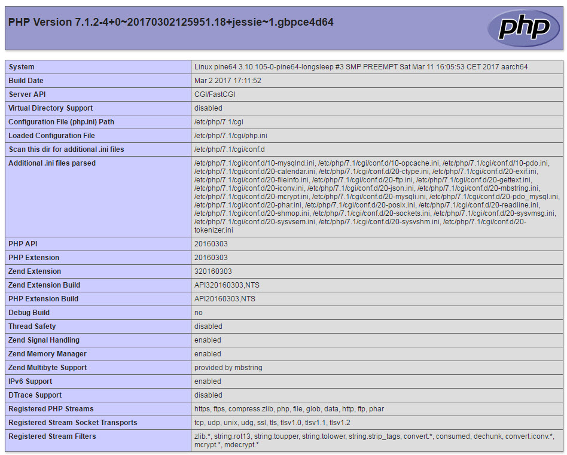
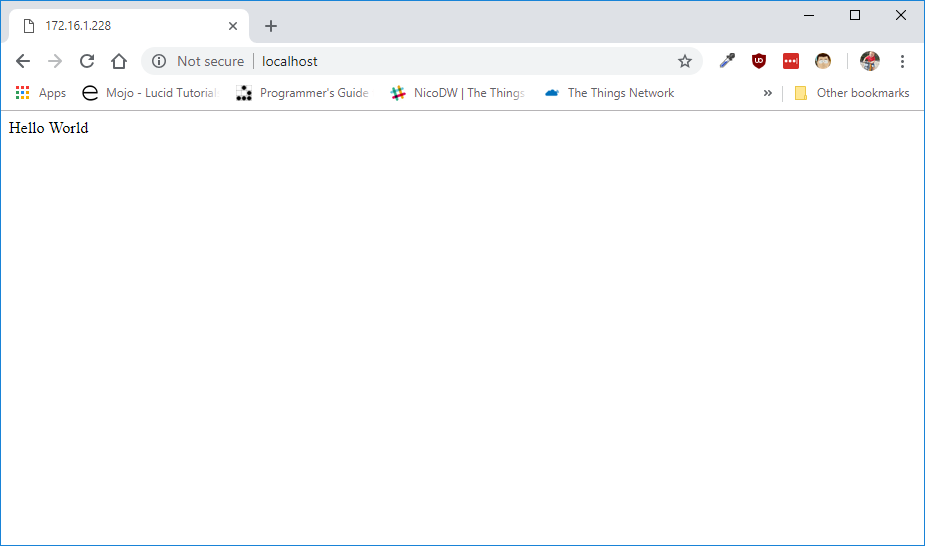

# PHP programming language


## Installation

Installing PHP on Linux is easy with the apt package manager. Just run the following command to install PHP 7 on the Raspberry Pi.

```shell
sudo apt install php libapache2-mod-php -y
```

Note that the command above actually installs two software packages.

* `php`: This is the PHP language interpreter. This is what we need to be able to process and execute any PHP code.
* `libapache2-mod-php`: This is the Apache module that will link both Apache and the PHP runtime. If Apache encounters any PHP file it can give it to the PHP runtime before returning a result.

## Testing it out

To test if the installation is successful and if Apache is able to process PHP code, a `.php` file can be created which calls the `phpinfo()` function.

```shell
cd /var/www/html
sudo nano index.php
```

Insert the following code inside the `index.php` file.

```php
<?php
phpinfo();
```

If you now surf to [http://localhost](http://localhost) (or the IP address), you should see alot of information about the PHP and Apache installation. This will confirm that PHP and Apache are configured correctly.



### Hello world

Now that there is confirmation that the setup is installed and configured well, lets create a _Hello World_ application. The application will pass a String type to the browser containing the text `"Hello World"`.

```shell
cd /var/www/html
sudo nano index.php
```

Now replace the previous code with the code below:

```php
<?php
echo "Hello World";
```

When surfing to the page now, it should show only the string `Hello World`.

