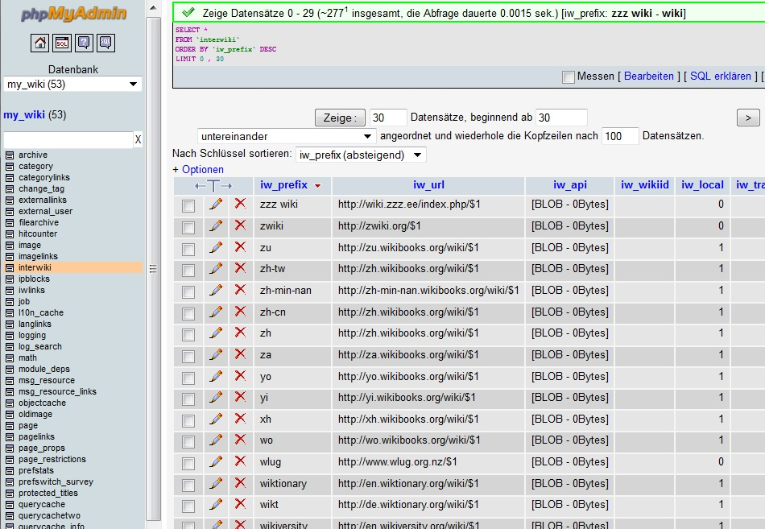

# phpMyAdmin

phpMyAdmin is a free and open source administration tool for MySQL and MariaDB. It is a portable web application written in PHP and can be used in a browser. It enables you to manage your database in a more graphical way than the mysql terminal client. It has many tools that make managing databases easier.

phpMyAdmin provides many forms to manage data and structure of databases, tables and properties. It will generate the corresponding SQL queries in the background. Therefore you could already do alot without knowing any SQL.



## Installation

Installation of phpMyAdmin is pretty straight forward. It can be installed using the apt package manager.

```
sudo apt install phpmyadmin -y
```

From now on, you can surf to [http://localhost/phpmyadmin](http://localhost/phpmyadmin) or using the IP address to access phpMyAdmin. There is just one thing that needs te be done when using the standard MySQL installer and settings.

phpMyAdmin enables users to manage there database from remote connections over the internet. Therefore using a default username `root` and an empty password (this is the default setting for MySQL) is a pretty bad idea. Anybody could access your database and do whatever they want. They could copy all your data, or even worse, they could delete everything.

phpMyAdmin enforces users to set a password for the `root` user. You can use the settings to disable this behavior, but this would again be an bad idea. To add an password to the `root` user you need to access the database using the `mysql` terminal client, and execute the query below. You need to change the `NEWPASSWORD` with the password you want the `root` user to have.

```
sudo mysql -u root
```

And then execute the following SQL queries:

```
UPDATE mysql.user SET plugin = 'mysql_native_password', 
  Password = PASSWORD('NEWPASSWORD') WHERE User = 'root';
FLUSH PRIVILEGES;
```

Now you should be able to login to phpMyAdmin using the user `root` and the password you have set.