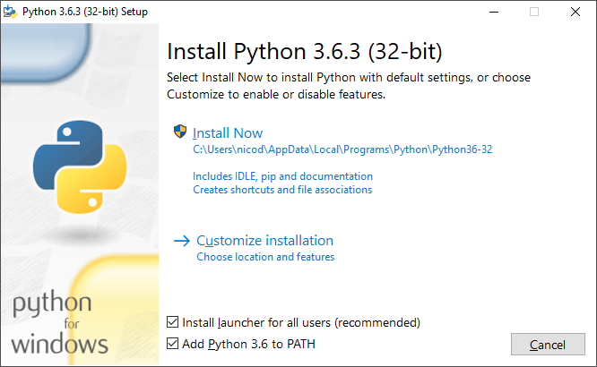
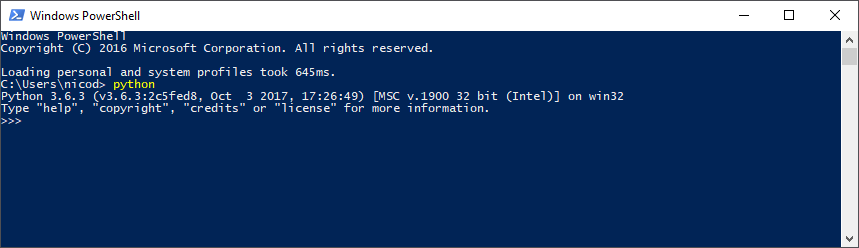
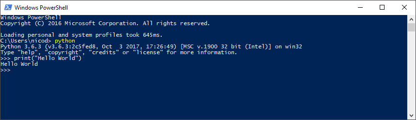
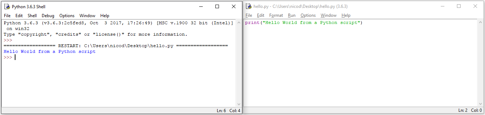

# Python intro

Python is a general-purpose programming language that appeals to all sorts of people: scripters, programmers, both beginners and experts. Even kids who learn their first programming skills. It's one of the most popular languages since 2003 according to the [TIOBE Index](https://www.tiobe.com/tiobe-index/python/). It is a high-level language with built-in support for high-level data types such as flexible arrays and dictionaries. Python is designed with a focus on readability, using whitespace significantly.

Python can be used for all sorts of scripting and application development:
* small and large automation tasks 
* database applications
* server side applications
* GUI applications
* data analysis ([Anaconda](https://www.anaconda.com/distribution/))
* AI ([Tensorflow](https://www.tensorflow.org/))
* games
* ...

Python is an interpreted language and therefore offers a much faster development cycle as compilation and linking is not necessary. It is a simple to use language, available on Windows, Mac OS X and Unix operating systems. The Python interpreter can also be used interactively, meaning you do not need to write a script/file just to have some Python fun.

> #### Info::Python the Name
>
> The language is named after Monty Python and has nothing to do with reptiles.

By splitting your program in modules, Python allows you to reuse these modules in other programs. By shipping Python with a large collection of standard modules providing functionality such as file I/O, system calls, sockets, and even interfaces to graphical user interface toolkits a programmer can do more complex task quicker and cleaner.

Python programs can be written very compactly and readable. It's syntax is notable shorter than many other high-level programming languages such as C++, Java, C#, ... It achieves this by
* allowing the developer to express complex operations in a single statement using high-level data types
* by shortening the basic syntax for example for grouping statements - grouping is done by indentation instead of braces
* it is not required to declare arguments and variables

It is also possible to extend Python using other popular programming languages such as C and C++.

## Requirements to start using Python

Basically all you need is the Python interpreter which can be downloaded at [https://www.python.org/downloads/](https://www.python.org/downloads/).


> #### Info::Python versions
>
> Python 3.x is the current version of the language. The final 2.x version 2.7 release came out in mid-2010, with a statement of extended support for this end-of-life release. Both are not compatible with each other. They even differ in syntax. Python 2 was very popular and a lot of Python 2 software can be found. In this course we only focus on Python 3.


### On the Raspberry Pi

With the Raspbian Linux distribution, you should already have both Python interpreters available. Both have been supplied as the system is still very dependent on Python 2 but wants to encourage the usage of Python 3.

By default Python 2 is used. If you wish to use Python 3 you can do so by adding a `3` after the command line tools. For example `python3` for the interpreter or `pip3` for the package manager. 

### Installing on Windows

When installing the package make sure to **add Python to the PATH**.



Just hit "Install Now" and let the wizard do his magic.

> #### Warning::If Python 2.x is already installed on Windows
>
> If you already have Python 2.x installed on Windows you may need to remove it from your path before you will be able to use Python 3.x as default. This can be achieved by going to `Advanced System Settings => Environment Variables => System Variables` and removing `C:\Python27\` and `C:\Python27\Scripts` from the path variable.

## Hello World in Python

A "Hello World!" program is a computer program that outputs or displays "Hello World" to the user. Being a very simple program in most programming languages, it is often used to illustrate the basic syntax of a programming language for a working program. It is often the very first program people write when they are new to the language.

In addition, "Hello world!" can be a useful test to make sure that a language's compiler, development environment, and run-time environment are correctly installed. Configuring a complete programming toolchain from scratch to the point where even trivial programs can be compiled and run can involve substantial amounts of work. For this reason, a simple program is used first when testing a new tool chain.

Basically there are two ways to write some Python code.
* First is via the interactive interpreter.
* Second by writing a script with the extension `.py` and executing it with the interpreter.

The first approach is useful to play around with some statements. If you close the terminal all code is lost. That is why it is only used for testing purposes. The interactive interpreter can be launched by opening a shell and typing `python` in powershell or `python3` on Raspbian. The result should be a Python 3.0 interactive interpreter terminal:



Try to outputting the string "Hello World" to the terminal by calling the print function:

```python
print("Hello World")
```

Some notes about this code:
* Print is a function which takes a string argument in its most basic form
* Print outputs text strings to the terminal
* Strings are pieces of text enclosed between double quotes `""`
* When calling a function, you need to add parentheses after the name of the function
* There is no need for a termination character at the end of a statement (like a `;` in C++)

The result should be something like this:



You can exit this interactive interpreter terminal by calling the function `exit()`. Once you do, all your code is lost.

Mostly a developer wishes to execute his code more than once and that is where Python script files comes into play. Create a Python script for example on your Desktop by creating a file called `hello.py`. By adding the `.py` extension, it is recognized as a Python script. Right click the file and select `Edit with IDLE`. This is a simple text-editor that comes with Python. You can also use your favorite text-editor (such Sublime, Atom, Microsoft Code, vim, eMacs, ...).

Start by adding the following code to the file:

```python
# Print out a hello message to the terminal
print("Hello World from a Python script")
```

The line with the hashtag `#` in front of it is called a comment. Everything following this is ignored by the interpreter. This allows you to add comments, explanation or documentation to your code.

In IDLE a Python script can be ran by selecting `Run => Run Module` or by pressing `F5` on the keyboard. The output should be similar to the one below.



Python scripts are interpreted from top to bottom as most languages. Compared to languages like C++ and Java, Python scripts have no entry point such as a main function. It just starts at the top.

## Building Blocks of a Programming Language

Almost every programming language out there has a number of basics building blocks required to solve problems and build programs.

The base of almost any computer program is the manipulation of data. Of course before a program can manipulate data it needs to be able to store it. For this it can use the computer memory. This computer memory is accessed via **variables**. Variables are used to store information to be referenced and manipulated in a computer program. They also provide a way of labeling data with a descriptive name, so our programs can be understood more clearly by the reader and ourselves. It is helpful to think of variables as containers that hold information. Their sole purpose is to label and store data in memory. This data can then be used throughout your program.

Most programs will performs some sort of operations on data they have at their disposal. We often say that they process the data. For this processing a programming language needs all sorts of **operators**. Some examples are mathematical operators or text operators.

Computer programs often have different things to do based on a certain situation. At certain points in the code, a decision has to be made. This requires that a **decision making** construct is available.

Software is ideal for executing repetitive tasks (things that have to be done multiple times). To be able to do things multiple times a programming languages needs some sort **loop constructs**.

The concept chapter discusses these building blocks.