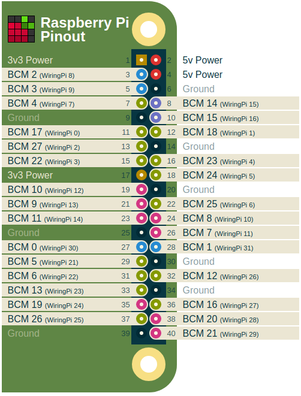

# GPIO Interfacing

This chapter introduces the basic interfacing of a GPIO on the Raspberry Pi. First an LED and pushbutton are connected to the Pi. Next these are approached using the gpio command line utility. Last they are interfaced from a python script.

## Pinout of Raspberry Pi

A handy website showing the pinout of the Raspberry Pi can be found at [https://pinout.xyz/](https://pinout.xyz/). It categorizes all pins nicely according to their function. It even has an Arduino compatible pinout for WiringPi [https://pinout.xyz/pinout/wiringpi](https://pinout.xyz/pinout/wiringpi).



Do note that WiringPi uses different pin numbers than the actual processor pins (BCM). Both numbering schemes are supported by wiringpi but it is recommended to the use the wiringpi pinout numbering when using the library or gpio utility.

## Installing WiringPi

Before starting make sure you have python3 installed by executing the command `python3 --version`. It should return a version similar to `Python 3.5.3`.

Do not install the wiringpi library using pip. This will install an unofficial library.

To install the official wiringpi library visit [http://wiringpi.com/download-and-install/](http://wiringpi.com/download-and-install/) or execute the commands below:

```shell
cd
git clone git://git.drogon.net/wiringPi
cd wiringPi
./build
```

If all went well, executing `gpio -v` should result in the following output:

```shell
gpio version: 2.46
Copyright (c) 2012-2018 Gordon Henderson
This is free software with ABSOLUTELY NO WARRANTY.
For details type: gpio -warranty

Raspberry Pi Details:
  Type: Pi 3+, Revision: 03, Memory: 1024MB, Maker: Sony 
  * Device tree is enabled.
  *--> Raspberry Pi 3 Model B Plus Rev 1.3
  * This Raspberry Pi supports user-level GPIO access.
```

## Connecting an LED

Starting simple is key. The most basic hardware setup one can build is attaching an LED to a GPIO and turning it on or off. The LED can then serve as an output indicator. Connect the LED as shown in the schematic below.

<!-- Fritzing diagram required here  -->

Note that the LED is attached to GPIO24 (BCM19).

## Connecting a pushbutton

Next an pushbutton can be attached to the Raspberry Pi so its state can be read. Make sure to follow the schematic exactly. The pullup resistor (10k or higher) pulls the input high if the pushbutton is not pressed. If this is not attached, the input may float.

<!-- Fritzing schematic of a pushbutton -->

Note that the pushbutton is attached to GPIO25 (BCM26).

## The GPIO Utility

The gpio utility can be driven be a simple bash script to do some simple testing of your Pi’s GPIO pins. A description of the tool and the available options can be found in the man pages. Just enter the command `man gpuio`.

### Readall

The `gpio readall` command gives a nice overview of all the GPIO's, the mode they are configured in and their current state.

```shell
+-----+-----+---------+------+---+---Pi 3+--+---+------+---------+-----+-----+
| BCM | wPi |   Name  | Mode | V | Physical | V | Mode | Name    | wPi | BCM |
+-----+-----+---------+------+---+----++----+---+------+---------+-----+-----+
|     |     |    3.3v |      |   |  1 || 2  |   |      | 5v      |     |     |
|   2 |   8 |   SDA.1 |   IN | 1 |  3 || 4  |   |      | 5v      |     |     |
|   3 |   9 |   SCL.1 |   IN | 1 |  5 || 6  |   |      | 0v      |     |     |
|   4 |   7 | GPIO. 7 |   IN | 1 |  7 || 8  | 0 | IN   | TxD     | 15  | 14  |
|     |     |      0v |      |   |  9 || 10 | 1 | IN   | RxD     | 16  | 15  |
|  17 |   0 | GPIO. 0 |   IN | 0 | 11 || 12 | 0 | IN   | GPIO. 1 | 1   | 18  |
|  27 |   2 | GPIO. 2 |   IN | 0 | 13 || 14 |   |      | 0v      |     |     |
|  22 |   3 | GPIO. 3 |   IN | 0 | 15 || 16 | 0 | IN   | GPIO. 4 | 4   | 23  |
|     |     |    3.3v |      |   | 17 || 18 | 0 | IN   | GPIO. 5 | 5   | 24  |
|  10 |  12 |    MOSI |   IN | 0 | 19 || 20 |   |      | 0v      |     |     |
|   9 |  13 |    MISO |   IN | 0 | 21 || 22 | 0 | IN   | GPIO. 6 | 6   | 25  |
|  11 |  14 |    SCLK |   IN | 0 | 23 || 24 | 1 | IN   | CE0     | 10  | 8   |
|     |     |      0v |      |   | 25 || 26 | 1 | IN   | CE1     | 11  | 7   |
|   0 |  30 |   SDA.0 |   IN | 1 | 27 || 28 | 1 | IN   | SCL.0   | 31  | 1   |
|   5 |  21 | GPIO.21 |   IN | 1 | 29 || 30 |   |      | 0v      |     |     |
|   6 |  22 | GPIO.22 |   IN | 1 | 31 || 32 | 0 | IN   | GPIO.26 | 26  | 12  |
|  13 |  23 | GPIO.23 |   IN | 0 | 33 || 34 |   |      | 0v      |     |     |
|  19 |  24 | GPIO.24 |   IN | 0 | 35 || 36 | 0 | IN   | GPIO.27 | 27  | 16  |
|  26 |  25 | GPIO.25 |   IN | 0 | 37 || 38 | 0 | IN   | GPIO.28 | 28  | 20  |
|     |     |      0v |      |   | 39 || 40 | 0 | IN   | GPIO.29 | 29  | 21  |
+-----+-----+---------+------+---+----++----+---+------+---------+-----+-----+
| BCM | wPi |   Name  | Mode | V | Physical | V | Mode | Name    | wPi | BCM |
+-----+-----+---------+------+---+---Pi 3+--+---+------+---------+-----+-----+
```

### Driving the LED

To drive the LED, the GPIO first needs to be configured as an output using the `gpio mode <pin> output|pwm|input`. Then its value can be written using the `gpio write <pin> 0|1` command. The commands below show how to set the GPIO as an output, drive it high and then low again.

```shell
gpio mode 24 output
gpio write 24 1
gpio write 24 0
```

The `readall` commands can be used between each command to check the effect of the command.

> **INFO** - **Watching the GPIOs**
>
> Want to continuously watch the GPIO as a real linux hacker? Than use the following watch command from a second terminal: `watch -n 1 gpio readall`. This executes the `gpio readall` command every second.

### Reading the Pushbutton State

To read the state of the pushbutton the GPIO needs to be configured as an input (by default so). Reading the GPIO can than be accomplished using the `gpio read <pin>` command.

```shell
gpio mode 25 input
gpio read
```

It should output `0` if the button is pressed and `1` if released.