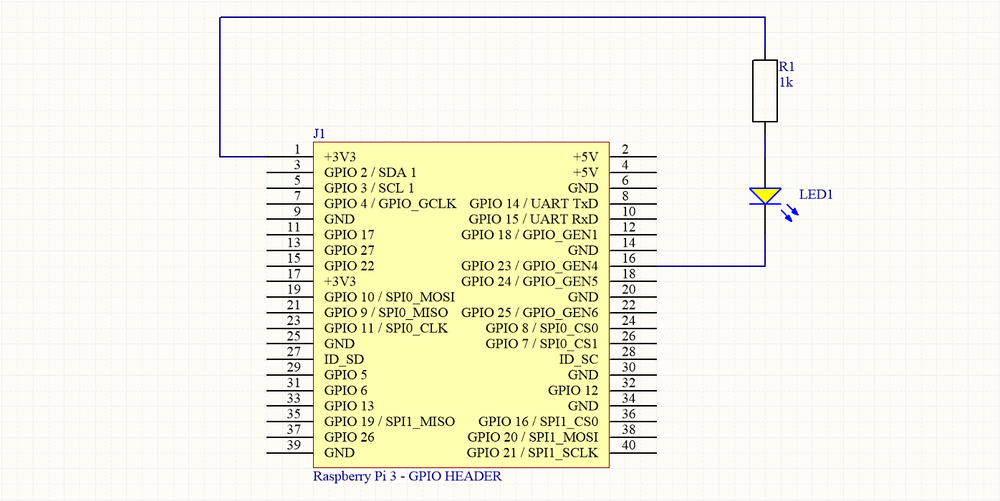
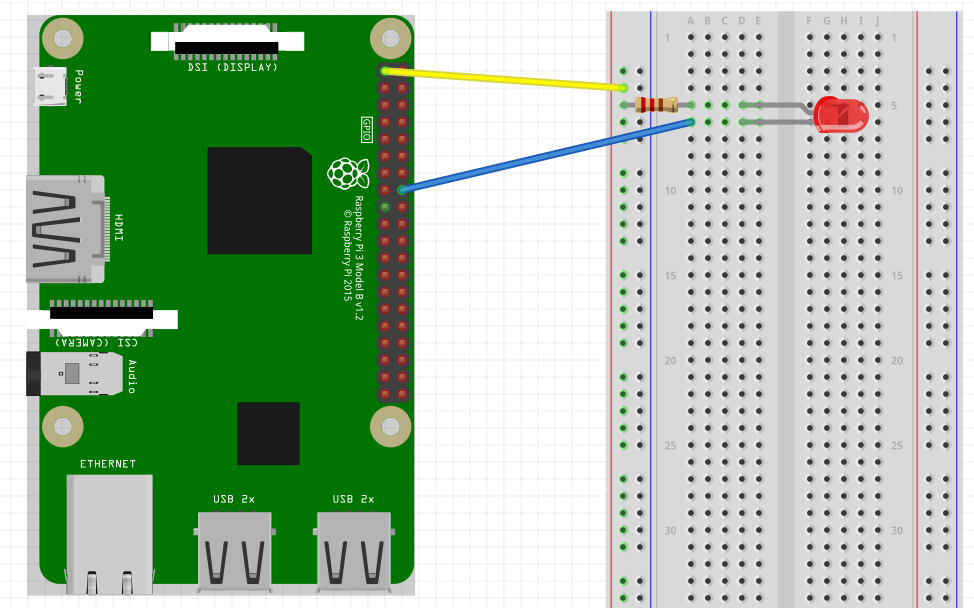

# GPIO Interfacing

This chapter introduces the basic interfacing of a GPIO on the Raspberry Pi. First an LED and pushbutton are connected to the Pi. Next these are approached using the gpio command line utility. Last they are interfaced from a python script.

## Pinout of Raspberry Pi

A handy website showing the pinout of the Raspberry Pi can be found at [https://pinout.xyz/](https://pinout.xyz/). It categorizes all pins nicely according to their function. It even has an Arduino compatible pinout for WiringPi [https://pinout.xyz/pinout/wiringpi](https://pinout.xyz/pinout/wiringpi).


Do note that WiringPi uses different pin numbers than the actual processor pins (BCM). Both numbering schemes are supported by wiringpi but it is recommended to the use the wiringpi pinout numbering when using the library or gpio utility.

## Installing WiringPi

To install the official wiringpi C library visit [http://wiringpi.com/download-and-install/](http://wiringpi.com/download-and-install/) or execute the commands below:

```shell
cd
git clone git://git.drogon.net/wiringPi
cd wiringPi
./build
```

If all went well, executing `gpio -v` should result in the following output:

```shell
gpio version: 2.46
Copyright (c) 2012-2018 Gordon Henderson
This is free software with ABSOLUTELY NO WARRANTY.
For details type: gpio -warranty

Raspberry Pi Details:
  Type: Pi 3+, Revision: 03, Memory: 1024MB, Maker: Sony 
  * Device tree is enabled.
  *--> Raspberry Pi 3 Model B Plus Rev 1.3
  * This Raspberry Pi supports user-level GPIO access.
```

Next we also need to install a wrapper library so the library can be used from within Python.

Before starting make sure you have python3 installed by executing the command `python3 --version`. It should return a version similar to `Python 3.5.3`.

Next make sure the system has the python package manager `pip3` installed by executing `pip3 --version`. It should return a version similar to `pip 9.0.1 from /usr/lib/python3/dist-packages (python 3.5)`. If not, you can install pip3 using the command `sudo apt update && sudo apt install python3-pip`.

Last we can install wiringpi using the command

```shell
sudo pip3 install wiringpi
```

More info about the library wrapper can be found at the Github repository [https://github.com/WiringPi/WiringPi-Python](https://github.com/WiringPi/WiringPi-Python).

## Connecting an LED

Starting simple is key. The most basic hardware setup one can build is attaching an LED to a GPIO and turning it on or off. The LED can then serve as an output indicator.

The LED has an anode and a cathode side. The anode side should be connected to the positive supply, while the cathode should be connected to the ground.

A diagram to identify both sides is shown below:


If we were to connect the LED directly to the power supply it would draw way to much current. To limit the current we need to place a resistor in series with the LED (as shown in the schematic in the next section). For this a 1k resistor can be used.


While a 1k resistor works to limit the current through the LED, it will not be ideal for the voltage and type of LEDs used here. In practice you should always take the voltage drop of the LED, the power supply and the preferred current (often 10mA or 20mA) into account. There are various sites you can use for this like for example: [http://www.ohmslawcalculator.com/led-resistor-calculator](http://www.ohmslawcalculator.com/led-resistor-calculator).

### Hardware Schematic and BreadBoard



It is important not to make the GPIO provide to much power as these are directly connected to the processor pins and no protection for overcurrent is provided. A microcontroller / microprocessor is not able to provide much current.

By connecting the anode side of the LED to VCC (+3V3 in this case) via a resistor, we actually do not let the GPIO source the current. The current is sourced by the power supply and it is sinked via the GPIO. A GPIO is often able to sink much more current than it can source.

Deciding what GPIO pin to use is not always easy. You need to make sure you are connecting to an already used pin or to a pin with a special function. A website such as [https://pinout.xyz/](https://pinout.xyz/) can be a nice aid.

Here we make use of **GPIO4** (BCM23) to connect the cathode of the LED. Connecting everything correctly should show a similar result to the image shown below.



> **INFO** - **Fritzing**
>
> The above image was created using a tool called Fritzing. Fritzing is an open-source hardware initiative that makes electronics accessible as a creative material for anyone. They offer a software tool, a community website and services in the spirit of Processing and Arduino, fostering a creative ecosystem that allows users to document their prototypes, share them with others, teach electronics in a classroom, and layout and manufacture professional PCBs.)

## Connecting a pushbutton

Next an pushbutton can be attached to the Raspberry Pi so its state can be read. Make sure to follow the schematic exactly. The pullup resistor (10k or higher) pulls the input high if the pushbutton is not pressed. If this is not attached, the input may float.

<!-- Fritzing schematic of a pushbutton -->

Note that the pushbutton is attached to GPIO25 (BCM26).

## The GPIO Utility

The gpio utility can be driven be a simple bash script to do some simple testing of your Pi’s GPIO pins. A description of the tool and the available options can be found in the man pages. Just enter the command `man gpuio`.

### Readall

The `gpio readall` command gives a nice overview of all the GPIO's, the mode they are configured in and their current state.

```shell
+-----+-----+---------+------+---+---Pi 3+--+---+------+---------+-----+-----+
| BCM | wPi |   Name  | Mode | V | Physical | V | Mode | Name    | wPi | BCM |
+-----+-----+---------+------+---+----++----+---+------+---------+-----+-----+
|     |     |    3.3v |      |   |  1 || 2  |   |      | 5v      |     |     |
|   2 |   8 |   SDA.1 |   IN | 1 |  3 || 4  |   |      | 5v      |     |     |
|   3 |   9 |   SCL.1 |   IN | 1 |  5 || 6  |   |      | 0v      |     |     |
|   4 |   7 | GPIO. 7 |   IN | 1 |  7 || 8  | 0 | IN   | TxD     | 15  | 14  |
|     |     |      0v |      |   |  9 || 10 | 1 | IN   | RxD     | 16  | 15  |
|  17 |   0 | GPIO. 0 |   IN | 0 | 11 || 12 | 0 | IN   | GPIO. 1 | 1   | 18  |
|  27 |   2 | GPIO. 2 |   IN | 0 | 13 || 14 |   |      | 0v      |     |     |
|  22 |   3 | GPIO. 3 |   IN | 0 | 15 || 16 | 0 | IN   | GPIO. 4 | 4   | 23  |
|     |     |    3.3v |      |   | 17 || 18 | 0 | IN   | GPIO. 5 | 5   | 24  |
|  10 |  12 |    MOSI |   IN | 0 | 19 || 20 |   |      | 0v      |     |     |
|   9 |  13 |    MISO |   IN | 0 | 21 || 22 | 0 | IN   | GPIO. 6 | 6   | 25  |
|  11 |  14 |    SCLK |   IN | 0 | 23 || 24 | 1 | IN   | CE0     | 10  | 8   |
|     |     |      0v |      |   | 25 || 26 | 1 | IN   | CE1     | 11  | 7   |
|   0 |  30 |   SDA.0 |   IN | 1 | 27 || 28 | 1 | IN   | SCL.0   | 31  | 1   |
|   5 |  21 | GPIO.21 |   IN | 1 | 29 || 30 |   |      | 0v      |     |     |
|   6 |  22 | GPIO.22 |   IN | 1 | 31 || 32 | 0 | IN   | GPIO.26 | 26  | 12  |
|  13 |  23 | GPIO.23 |   IN | 0 | 33 || 34 |   |      | 0v      |     |     |
|  19 |  24 | GPIO.24 |   IN | 0 | 35 || 36 | 0 | IN   | GPIO.27 | 27  | 16  |
|  26 |  25 | GPIO.25 |   IN | 0 | 37 || 38 | 0 | IN   | GPIO.28 | 28  | 20  |
|     |     |      0v |      |   | 39 || 40 | 0 | IN   | GPIO.29 | 29  | 21  |
+-----+-----+---------+------+---+----++----+---+------+---------+-----+-----+
| BCM | wPi |   Name  | Mode | V | Physical | V | Mode | Name    | wPi | BCM |
+-----+-----+---------+------+---+---Pi 3+--+---+------+---------+-----+-----+
```

### Driving the LED

To drive the LED, the GPIO first needs to be configured as an output using the `gpio mode <pin> output|pwm|input`. Then its value can be written using the `gpio write <pin> 0|1` command. The commands below show how to set the GPIO as an output, drive it high and then low again.

```shell
gpio mode 4 output
gpio write 4 1
gpio write 4 0
```

The `readall` commands can be used between each command to check the effect of the command.

> **INFO** - **Watching the GPIOs**
>
> Want to continuously watch the GPIO as a real linux hacker? Than use the following watch command from a second terminal: `watch -n 1 gpio readall`. This executes the `gpio readall` command every second.

To make the LED blink, you can also make use of the `gpio blink <pin>` command, which puts the GPIO in an output state and makes it blink periodically.

```shell
gpio blink 4
```

### Reading the Pushbutton State

To read the state of the pushbutton the GPIO needs to be configured as an input (by default so). Reading the GPIO can than be accomplished using the `gpio read <pin>` command.

```shell
gpio mode 25 input
gpio read
```

It should output `0` if the button is pressed and `1` if released.

## Interfacing GPIOs from Python

Interfacing with the GPIO's from Python is not a lot harder than using the gpio utility. Scripting it from Python has the advantage that it is a lot more versatile and and can be integrated into our applications.

### Driving an Output

The example code below shows how an output can be driven high and low from python using wiringpi:

```python
import wiringpi
from time import sleep

wiringpi.wiringPiSetup()    # Use WiringPi numbering

PIN_NUMBER = 4

wiringpi.pinMode(PIN_NUMBER, 1)        # Set LED pin to 1 ( OUTPUT )

while True:
  print("Setting LED on")
  wiringpi.digitalWrite(PIN_NUMBER, 0)   # Write 0 ( LOW ) to LED pin
  sleep(1)
  print("Setting LED off")
  wiringpi.digitalWrite(PIN_NUMBER, 1)   # Write 1 ( HIGH ) to LED pin
  sleep(1)
```

Integrating this functionality into the previously created `Led` class leads to a much cleaner application.

```python
import wiringpi
from time import sleep

class Led(object):
  def __init__(self, pin):
    self.pinNumber = pin
    wiringpi.wiringPiSetup()    # Use WiringPi numbering
    wiringpi.pinMode(self.pinNumber, 1) # As output
    self.off()

  def on(self):
    self.set_state(True)

  def off(self):
    self.set_state(False)

  def toggle(self):
    self.set_state(not self.get_state())

  def set_state(self, state):
    self.isOn = state
    wiringpi.digitalWrite(self.pinNumber, state)   # Write state to LED pin

  def get_state(self):
    return self.isOn

# The main program
led = Led(4)

while True:
  print("Toggling the LED")
  led.toggle()
  sleep(1)
```

### Reading an Input

The example code below shows how an input can be read from python using wiringpi:

```python
import wiringpi
from time import sleep

wiringpi.wiringPiSetup()    # Use WiringPi numbering

PIN_NUMBER = 25

wiringpi.pinMode(PIN_NUMBER, 0)        # Set Pushbutton pin to 0 ( INPUT )

while True:
  state = wiringpi.digitalRead(PIN_NUMBER)
  print("The push button state = {}".format(state))
  sleep(1)
```

Now refactoring this to a nice `Button` class:

```python
import wiringpi
from time import sleep

class Button(object):
  def __init__(self, pin):
    self.pinNumber = pin
    wiringpi.wiringPiSetup()    # Use WiringPi numbering
    wiringpi.pinMode(self.pinNumber, 0)        # Set button pin to 0 ( INPUT )

  def get_state(self):
    return wiringpi.digitalRead(self.pinNumber)

# The main program
button = Button(25)

while True:
  print("The push button state = {}".format(button.get_state()))
  sleep(1)
```

<!-- TODO:
* Making the button drive the LED -->