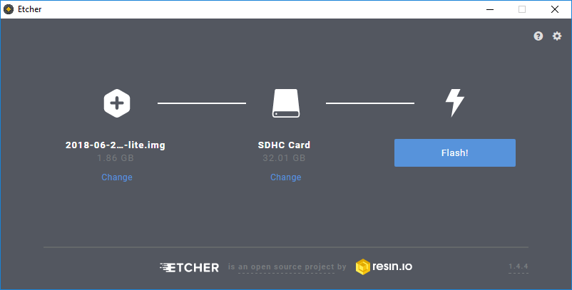

# The Raspberry Pi

<!-- Just some introduction to the raspberry pi -->

## RPi Operating Systems

The Raspberry Pi foundation provides several ready to use operating system images for the Pi. At the moment of this writing the following are available:

* **Raspbian** - The Foundation's official supported operating system (Debian Jessie)
* **Ubuntu Mate** - Official Ubuntu flavor featuring the MATE desktop
* **Snappy Ubuntu Core** - A new, transactionally-updated Ubuntu for IoT devices, clouds and more
* **OSMC** - Open Source Media Centre
* **OPENELEC** - Open Embedded Linux Entertainment Centre
* **PINET** - Raspberry Pi Classroom Management Solution
* **Windows 10 IoT Core**
* **RISC OS** - A non-Linux distribution

## Setting up the Raspberry Pi with Raspbian

For this course we will be using the Raspbian image. While Ubuntu Mate features a nicer graphical environment, Raspbian is the most widely-supported OS.

While the instructions further on are based on how to equip the Raspberry Pi with Raspbian, they are very similar for most other distributions.

### Creating a bootable SD card

You can download the latest image of Raspbian via the Raspberry Pi website ([https://www.raspberrypi.org/downloads/](https://www.raspberrypi.org/downloads/)). Make sure to pick the "Raspbian Stretch with Desktop" edition. You can leave the zipped file as is, the SD card flash tool extracts it automatically.

> **INFO** - **Lite and Desktop Edition**
>
> The Lite edition of Raspbian is the one without a graphical desktop environment. If you were to attach a display to the Raspberry Pi, all you would see would be a TTY with a login prompt. If you require a GUI, you need to download the normal Desktop image.

The current Raspbian version at the moment of this writing is of November with a Linux kernel version of 4.14. You can always check out the release notes on [http://downloads.raspberrypi.org/raspbian/release_notes.txt](http://downloads.raspberrypi.org/raspbian/release_notes.txt).

To boot the Linux distribution, the image needs to be written to an SD card of at least 4GB. A popular tool to write an image to an SD card is **Etcher**, which can be downloaded at [https://etcher.io/](https://etcher.io/).

> **INFO** - **Other host operating systems**
>
> Check out [http://www.raspberrypi.org/documentation/installation/installing-images/README.md](http://www.raspberrypi.org/documentation/installation/installing-images/README.md) for instructions on deploying the image to an SD card when using a different host operating system such as Linux or Mac.

Make sure to select the correct device letter as a target and load the Linux image from your local drive as shown in the image below. If you're ready, hit the flash button and grab a cup of coffee.

Once the write process is finished, you can remove the SD card from the computer, and plug it into the Raspberry Pi.

### A Graphical Desktop Environment

If you deployed an OS such as Raspbian than you can attach an HDMI display or RCA Video compatible device (yellow connector on the older Raspberry Pi boards). You will also have to connect a USB keyboard to the RPi to be able to control it. Depending on the operating system and the edition (normal or lite), you will get a graphical desktop environment or a tty terminal.

